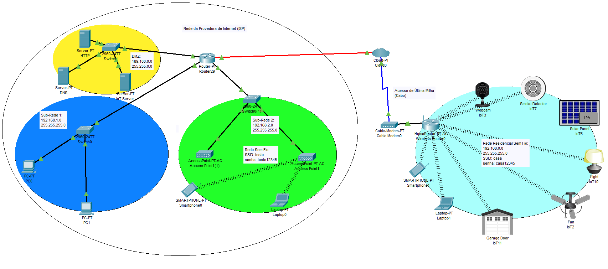

# Internet Protocols on Cisco Packet Tracer
The picture shows a house connected to a Internet Service Provider (ISP) by means of a cable modem on Packet Tracer. The residence has IoT devices connected to the cloud, controlled by a web-based platform. 
1. Access the IoT web platform (www.iot.com.br) on a web browser in a laptop device in the Packet Tracer program provided above. 
    User: admin , password: admin
2. Switch the status of each IoT devices to see if there are any changes.
3. Use the simulation function in Packet Tracer to observe the trafic flow and the OSI model Stack.

