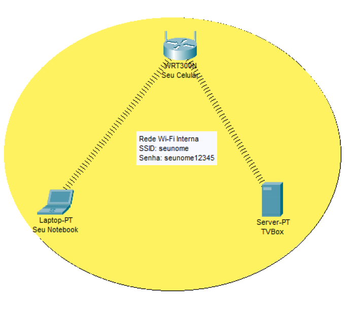
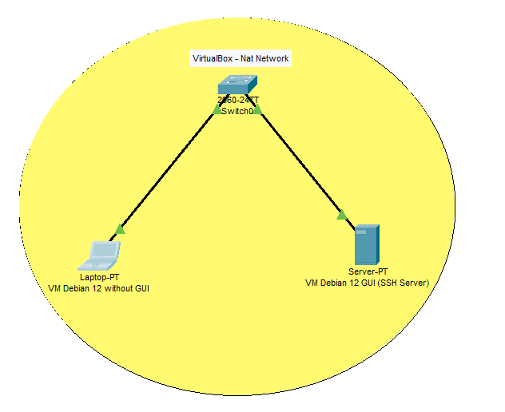

# SSH service on Wi-Fi network 
The pictures shows a Wi-Fi network with 3 devices:
1. Your mobile phone acting as a Wi-Fi router
2. Your notebook
3. The TVBox embedded with armbian operating system, running a SSH server.

To access the TVBox from your computer via the SSH service, you must follow these steps:

1. Create a Wi-Fi network by setting up your mobile phone as a Wi-Fi router.
2. Connect your notebook and TVBox to your mobile phone's Wi-Fi network.
3. Run Wireshark on your computer, capturing packets through its Wi-Fi network adapter.
4. Access the TVBox from your computer using SSH commands through a terminal (such as PuTTY, Tera Term, etc.).
5. Observe the packets in Wireshark and verify how SSH messages are exchanged between your computer and the TVBox.

 

# SSH Service on VirtualBox network (in case of no WiFi connectivity on Armbian TVBox)

The pictures shows two Virtual Machines (VM) running on VirtualBox:
1. A VM running Debian 12 (bookworm) with Graphical Interface (GUI).
2. Another VM running Debian 12 (bookworm) without GUI.
3. VirtualBox acting as a switch/router

To access the Debian 12 GUI VM via the SSH service, you must follow these steps:
1. Verify if both VM network interfaces are configured as NAT.
2. Check the IP address of Debian 12 GUI VM.
3. Install and Run Wireshark on Debian 12 GUI VM.
4. Install SSH Server on Debian 12 GUI VM (sudo apt-get install ssh).
5. Install SSH client on Debian 12 without GUI (sudo apt-get install openssh-client)
6. Access the Debian 12 GUI from Debian 12 without GUI by means of SSH commands.
7. Observe the packets in Wireshark and verify how SSH messages are exchanged between these two VMs.

**Warning**: download the Debian 12 (Bookworm) image [here](https://www.debian.org/distrib/netinst) . During the instalation proceedings, unmark Desktop Environment box to not install Graphical Interface on Debian 12 without GUI VM.

 

