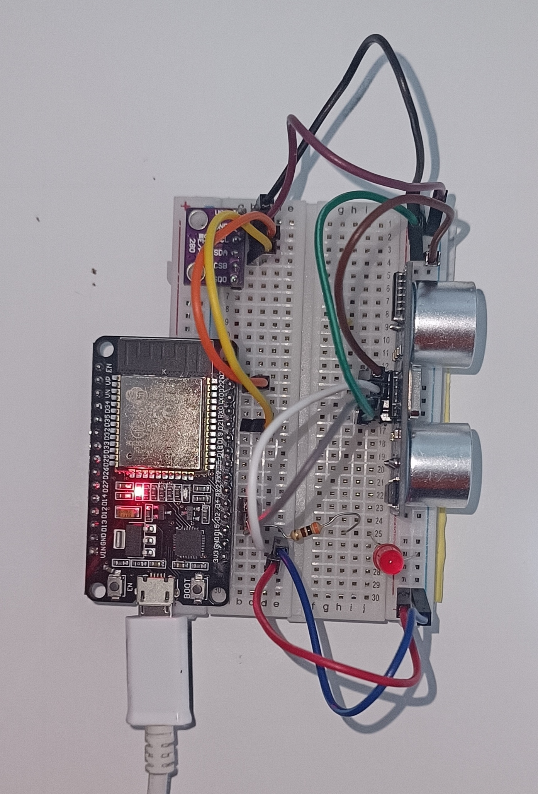

:Author: dhiegofc
:Email: dhiego.fernande@unesp.br
:Date: 29/03/2024
:Revision: 1
:License: Public Domain

= Project: ESP32 Connected to HC-SR04 and BME280 Sensors Integrated to Arduino IoT Cloud

ESP32 connected to HC-SR04 and BME280 sensors, and also a red led, to be integrated to Arduino IoT Cloud.

== Step 1: Arduino IoT Cloud

* Create a Esp32 Thing on Arduino IoT Cloud.
* Connected the variables to the ESP32 Thing on Arduino IoT Cloud.

== Step 2: Assemble the sensors, the red led and esp32 on a breadboard.

=== BOM
The materials you need for this project.

|===
| **ID** | **Part name**        | **Quantity**
| R1 | Resistor         | 1       
| L1 | Red LED          | 1        
| E1 | ESP32            | 1
| S1 | BME280           | 1
| S2 | HC-SR04          | 1           
|===

=== Observe the ESP32 Pinout

image::../../../../images/ESP32_pinout.jpg[ESP32 Pinout]

=== Assemble the ESP32 to HC-SR04 Sensor

image::../../../../images/ESP32_HCSR04.png[ESP32 HC-SR04]

Pinout HC-SR04:
|===
| **HC-SR04** | **ESP32**       
| VCC     | VCC          
| Trig    | GPIO4              
| Echo    | GPIO2
| GND     | GND                             
|===

=== Assemble the ESP32 to HC-SR04 Sensor

image::../../../../images/ESP32_BME280.png[ESP32 BME280]

Pinout HC-BM280:
|===
| **HC-SR04** | **ESP32**       
| VCC     | VCC 
| GND     | GND           
| SCL     | GPIO22              
| SDA     | GPIO21
| CSB     | -
| SDO     | -                        
|===

=== The Whole circuit on breadboard

Use GPIO15 to control RED LED.

== Step 3: Download the files in this project.

=== Folder structure

....
 ESP32_Thing_Sensors                => Arduino sketch folder
  ├── ESP32_Thing_Sensors.ino       => main Arduino file
  ├── thingProperties.h             => thing Properties to connect to Arduino IoT Cloud
  └── ReadMe.adoc                   => this file
....

== Step 4: Run ESP32_Thing_Sensors.ino on Arduino IDE.

== Step 5: Observe the sensor variables and control the red led on Arduino IoT Cloud.

=== License
This project is released under a {License} License.

=== Contributing
To contribute to this project please contact: dhiego.fernandes@unesp.br

=== Help
This document is written in the _AsciiDoc_ format, a markup language to describe documents. 
If you need help you can search the http://www.methods.co.nz/asciidoc[AsciiDoc homepage]
or consult the http://powerman.name/doc/asciidoc[AsciiDoc cheatsheet]
