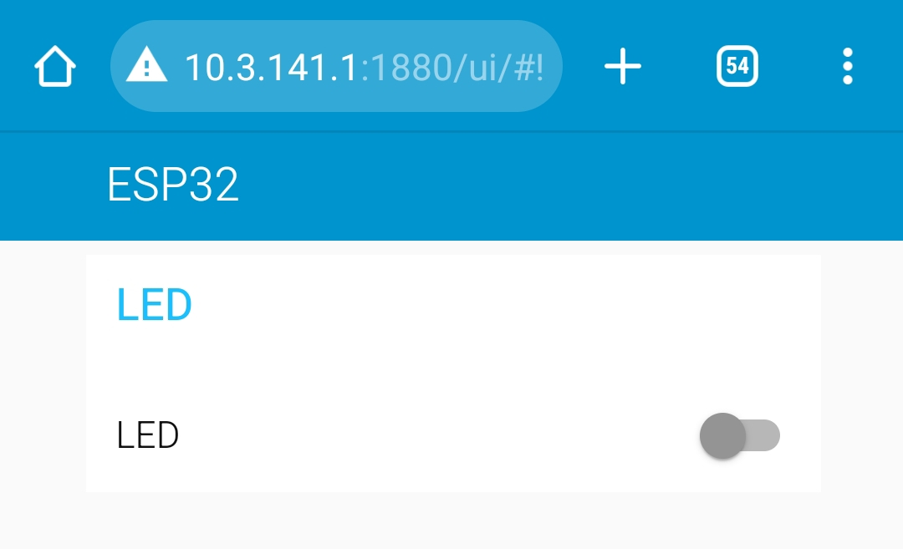
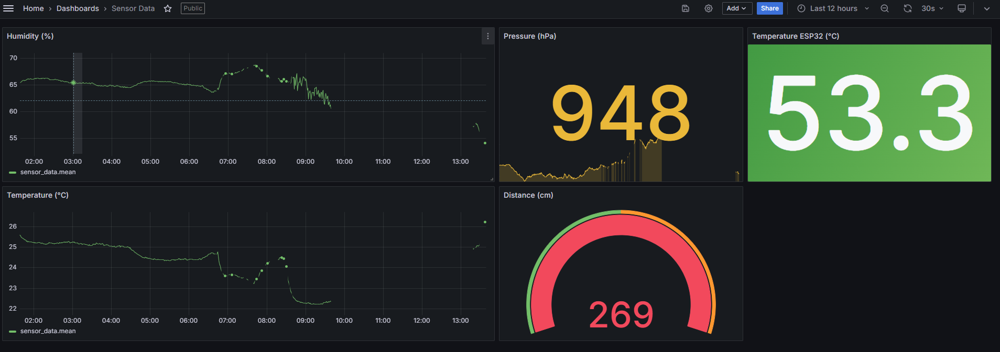

# ESP32 with Embedded Sensors Connected to a Linux Virtual Machine Featuring Node-Red, InfluxDB and Grafana

* Assemble the sensors to the ESP32. You can read [this guidance](Esp32_NodeRed_Influxdb_Grafana/ReadMe.adoc) to assembly the beardboard.
* Use the [provided ESP32 code](Esp32_NodeRed_Influxdb_Grafana/) to connect ESP32 to the provided Wi-Fi AP embedded with MQTT broker.
* Create a Linux Virtual Machine in VirtualBo. Configure one of its network interface as a bridge to receive an IP address from your PC's network.
* Install Node-Red, InfluxDB and Grafana on your Linux VM.
* Create the sensor_data database in InfluxDB.
* Use the [provided Node-Red Flows](Node_Red/sensor_and_led_flows.json) to receive MQTT messages from ESP32, store sensor measurements in the database, and control the LED from the Node-Red dashboard. Refer to the figure below:

**WARNING** Do NOT forget to update the InfluxDB address in the sensor data flow to match the IP of your Linux VM's network bridge interface.

* Connect Grafana to the sensor_data database and visualize measurements from each sensor (temperature, temperature_esp32, humidity, pressure, and distance). See the figure below:

**Note**: For guidance on integrating the ESP32 to an Linux Virtual Machine server Featuring Node-Red, InfluxDB, and Grafana, consider watching this instructional video on 

