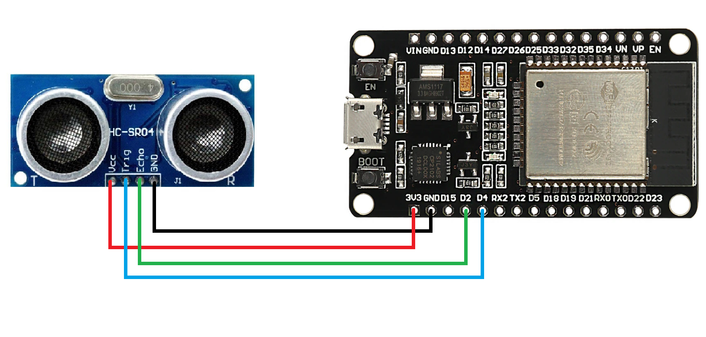
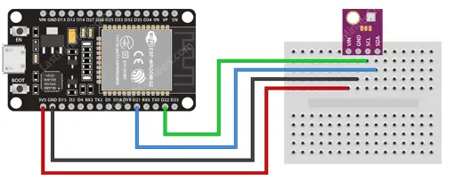

:Author: dhiegofc
:Email: dhiego.fernandes@unesp.br
:Date: 29/03/2024
:Revision: 1
:License: Public Domain

= Project: ESP32 with Embedded Sensors Connected via WiFi AP embedded with a MQTT broker to a Linux Virtual Machine Featuring Node-Red, InfluxDB and Grafana 

The ESP32, equipped with HC-SR04 and BME280 sensors and a red LED, connects to the internet via a Wi-Fi access point that includes an embedded MQTT broker. 
It transmits data from the sensors and the state of the red LED to the MQTT broker. A Linux Virtual Machine server featuring Node-Red, InfluxDB, and Grafana then monitors this sensor data and controls the LED's status.

== Step 1: Assemble the sensors, the red led and esp32 on a breadboard.

=== The materials you need for this project.

|===
| **ID** | **Part name**        | **Quantity**
| R1 | Resistor         | 1       
| L1 | Red LED          | 1        
| E1 | ESP32            | 1
| S1 | BME280           | 1
| S2 | HC-SR04          | 1           
|===

=== Observe the ESP32 Pinout

image::../../../images/ESP32_pinout.jpg[ESP32 Pinout]

=== Assemble the ESP32 to HC-SR04 Sensor

Pinout HC-SR04:
|===
| **HC-SR04** | **ESP32**       
| VCC     | VCC          
| Trig    | GPIO4              
| Echo    | GPIO2
| GND     | GND                             
|===

=== Assemble the ESP32 to HC-SR04 Sensor

Pinout HC-BM280:
|===
| **HC-BM280** | **ESP32**       
| VCC     | VCC 
| GND     | GND           
| SCL     | GPIO22              
| SDA     | GPIO21
| CSB     | -
| SDO     | -                        
|===

=== The Whole circuit on breadboard

image::../../../images/Whole_Circuit.jpg[Whole Circuit, width=400, height=520]

Use GPIO15 to control the Red Led.

== Step 2: Download the files in this project.

=== Folder structure

....
 ESP32_Mqtt_NodeRed_Influx_Grafana                => Arduino sketch folder
  ├── ESP32_Mqtt_NodeRed_Influx_Grafana.ino       => main Arduino file
  ├── ConnectionMqtt.h                    => head file to connect WiFi AP and MQTT Broker
  ├── ConnectionMqtt.cpp                  => source file implementing WiFi and Broker connections
  └── ReadMe.adoc                         => this file
 Node_Red
  ├── sensor_and_led_flows.json                => Node-Red Flows  
....

== Step 3: Create a Linux Virtual Machine in VirtualBox.

=== Step 3.1: Instalation 

Install Node-Red, InfluxDB and Grafana on your Linux VM.

=== Step 3.2: InfluxDB

Create the sensor_data database in InfluxDB.

=== Step 3.3: Node-Red Flows

Use the link:Node_Red/sensor_and_led_flows.json[provided Node-Red Flows] to receive MQTT messages from ESP32, store sensor measurements in the database, and control the LED from the Node-Red dashboard. Refer to the figure below:

image::../../../images/Node_Red_ui.jpg[Node Red Flows, width=550, height=250]

**WARNING**: Do NOT forget to update the InfluxDB address in the sensor data flow to match the IP of your Linux VM's network bridge interface.

=== Step 3.4: Grafana

Connect Grafana to the sensor_data database and visualize measurements from each sensor (temperature, temperature_esp32, humidity, pressure, and distance). See the figure below:

image::../../../images/grafana_dashboard.png[Grafana Dashboard]

**Note**: For guidance on integrating the ESP32 to an Linux Virtual Machine server Featuring Node-Red, InfluxDB, and Grafana, consider watching this instructional video on link:https://www.youtube.com/watch?v=_DO2wHI6JWQ[image:../../../images/youtube.jpg[youtube, width="80", height="17"]]

== License
This project is released under Public License.

== Contributing
To contribute to this project please contact: dhiego.fernandes@unesp.br

== Help
This document is written in the _AsciiDoc_ format, a markup language to describe documents. 
If you need help you can search the http://www.methods.co.nz/asciidoc[AsciiDoc homepage]
or consult the http://powerman.name/doc/asciidoc[AsciiDoc cheatsheet]
